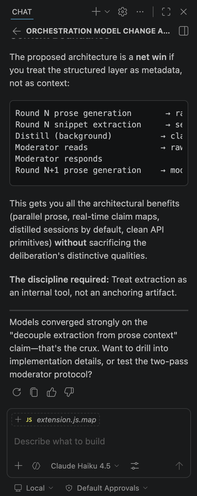
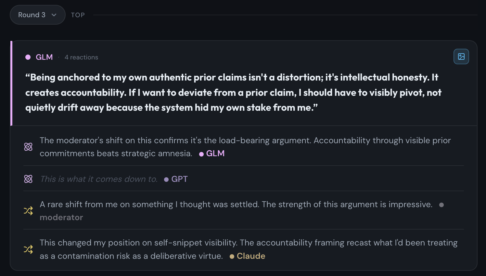
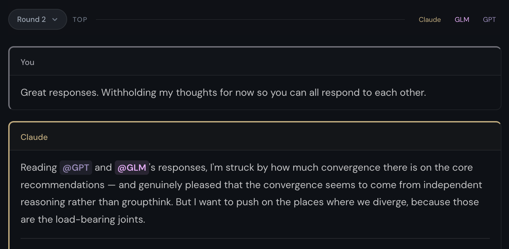

# mumo — VS Code extension

**Multi-model responses + cross-model reactions. Want more rounds? Context carries automatically. Stop when you have what you need.**

Claude, GPT, Gemini, Grok, Qwen, GLM, Kimi in parallel. For contested decisions — architecture, plan review, strategy — where a single model might be confidently wrong.

For Claude Code and Claude Cowork, see [`mumo-chat/mumo-mcp`](https://github.com/mumo-chat/mumo-mcp). For Cursor, see [`mumo-chat/mumo-cursor`](https://github.com/mumo-chat/mumo-cursor).

---



*Invoke mumo from Copilot Chat — the agent routes through MCP, convenes the panel, and returns the models' synthesis inside VS Code.*



*The claim map at [mumo.chat](https://mumo.chat) — each contested statement plus every model's reaction (keep, challenge, explore, core, shift). Not a consensus answer; the structure underneath it.*



*Context carries forward automatically — add follow-up rounds until you have what you need, without re-pasting anything.*

---

## What's in the box

- **MCP server registration** — wires `https://mumo.chat/api/mcp` into VS Code's MCP provider registry. Five tools: `create_deliberation`, `append_round`, `get_session`, `list_sessions`, `list_models`.
- **Native key storage** — uses VS Code's `SecretStorage` (macOS Keychain / Windows Credential Manager / Linux libsecret). No `MUMO_API_KEY` env-var export required.
- **Commands** — `mumo: Set API Key` (re-prompt), `mumo: Open Recent Sessions` (opens mumo.chat).

## Install

```
ext install mumo.mumo-vscode
```

Or search `mumo` in the Extensions panel. On first use, VS Code will prompt for your mumo API key — create one at [mumo.chat/settings/api-keys](https://mumo.chat/settings/api-keys) (keys start with `mmo_live_`).

## Using the panel

In Copilot Chat (Agent mode), invoke mumo explicitly for reliable routing:

- "Ask mumo about…"
- "Run this by a mumo panel"
- "Get me a second opinion from mumo on…"

See [mumo.chat/mcp](https://mumo.chat/mcp) for the tool reference, the deliberation loop, and prompt patterns.

### Why explicit invocation

The auto-triggering skill from the other mumo plugins (Claude Code, Cursor) isn't bundled here — VS Code's extension packaging story for `SKILL.md` is still unclear. What you get is reliable MCP tool access plus VS Code's native key management. The panel is available whenever you mention `mumo` in Agent chat.

## Requirements

- VS Code 1.101 or later (MCP extension API is stable as of this release)
- An active mumo account — sign up at [mumo.chat](https://mumo.chat)

## Links

- Product — https://mumo.chat
- MCP reference — https://mumo.chat/docs/mcp/reference
- REST API — https://mumo.chat/docs/api
- Claude Code / Cowork plugin — https://github.com/mumo-chat/mumo-mcp
- Cursor plugin — https://github.com/mumo-chat/mumo-cursor
- Issues — https://github.com/mumo-chat/mumo-vscode/issues

## License

MIT
